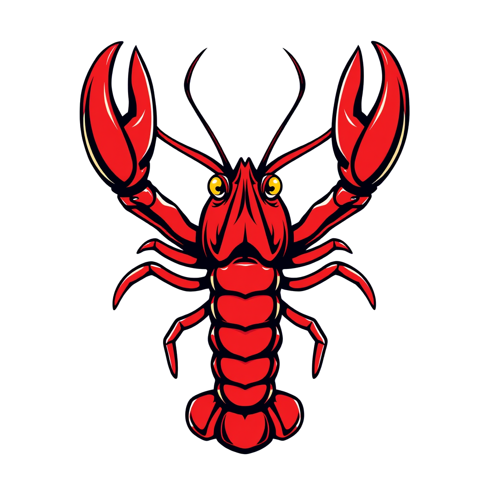

# Clawsome
A lean python harness for running persistent AI agents.

## Names

- Repo: `clawsome`
- Python module / `import`: `claw`

## Quick start

`matrix-nio[e2e]` requires libolm. On macOS, `python-olm` builds from source
(no PyPI wheels) and the bundled libolm needs two patches against modern
cmake + Apple Clang — see the matrix-nio / python-olm install notes.

```
brew install libolm
pip install -e .
cp claw.example.yaml claw.yaml      # edit, then:
claw --config claw.yaml
```

## Architecture

A clawsome process manages **N agents**, each with a **workspace** (state on
disk) and **one or more channels** (inbound surfaces — Matrix is the shipped
one). Per-turn, the agent loads its transcript, assembles a system prompt
from injected identity files + retrieved memory, runs an Ollama tool loop,
and replies. Background tasks (compaction, memory_flush, reindex, cron,
session rotate) run off the user-reply path.

→ See [`docs/architecture.md`](docs/architecture.md) for the full mental
model, request lifecycle, and workspace file contract.

## Configuration

`claw.yaml` is parsed once at startup; editing requires a restart. The
shipped `claw.example.yaml` is a runnable template with inline comments.
Tokens and passwords live in separate `*_file:` paths (mode 0600) so the
yaml itself is safe to share as a config example.

→ See [`docs/configuration.md`](docs/configuration.md) for the full key-by-key
reference.

## Operations

Background tuning, daily session rotate, memory retrieval cadence, Matrix
bot first-deploy (token + cross-signing UIA + ghost-DM avoidance), and
log-based troubleshooting.

→ See [`docs/operations.md`](docs/operations.md).

## Extending

Three extension points: **skills** (workspace-local; markdown protocol +
optional `tool.py`), **built-in tools** (in-tree; universal capability),
**channels** (in-tree; new inbound surface). Skills cover 99% of cases.

→ See [`docs/extending.md`](docs/extending.md).

## Deployment

`pip install` exposes a `claw` console script that takes
`--config <path/to/claw.yaml>` and runs in the foreground. Wire it into
launchd / systemd / your process manager of choice as a long-lived service
running under a dedicated user. This repo intentionally does not ship
example service files — paths, log destinations, and label/unit names all
depend on the host layout.
